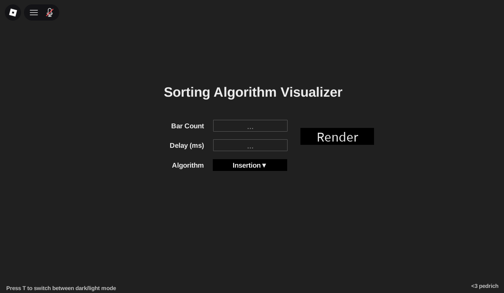

# Sorting algorithms visualizer

A random coding project done in a day   

If you want to see this in Roblox Studio, edit the uncopylocked version that can be found here: https://www.roblox.com/games/76678611599769/Sorting-Algorithm-Visualizer

-> Choose between a plethora of sorting algorithms (Bogo, Selection, Insertion, Heapsort, Bubble)   
-> Mess with other properties like *bar count* and *internal delay*  
-> 🌓Switch between light mode and dark mode  

